# Antsy

Antsy makes it really easy to do multi-line console animation in Go. Just write a string to Antsy, and it'll figure out all the ANSI commands.

For example, this:

<!--
termtosvg -t window_frame -g 60x10
-->


Was generated by this:

```go
package main

import (
	"fmt"
	"time"

	"github.com/bfirsh/antsy"
	"github.com/fatih/color"
)

func main() {
	printer := antsy.NewPrinter()

	for i := 1; i <= 100; i++ {
		printer.Print(color.GreenString("0 tests passed ") + "\n" +
			color.RedString(fmt.Sprintf("%d tests failed", i)) + "\n")

		time.Sleep(100 * time.Millisecond)
	}
}
```


## Install

    go get github.com/bfirsh/antsy

## Todo

- Handle stuff wider than the terminal
- Layout helpers, link [ink](https://github.com/vadimdemedes/ink)'s
- Example of how to do interactive things like a form (with helpers?)
- Simplify output for logs/CI/non-TTYs
- Tests (with a terminal emulator?)
- Stick stuff to bottom of screen, like apt's progress bar
